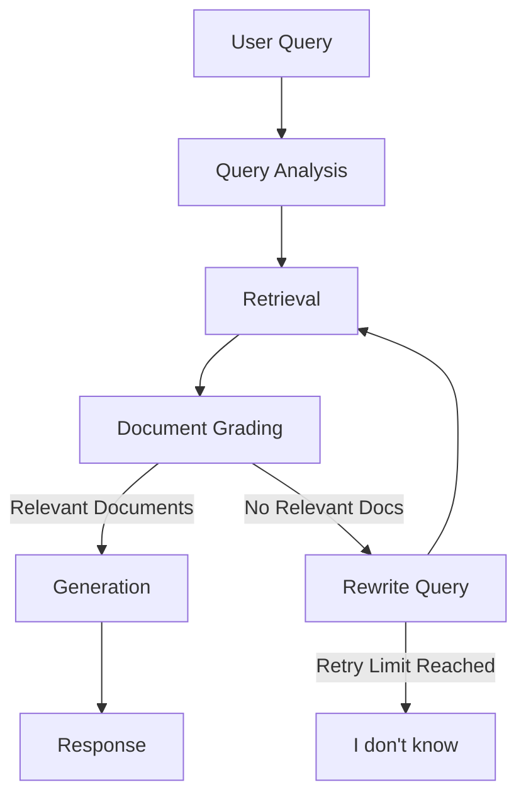
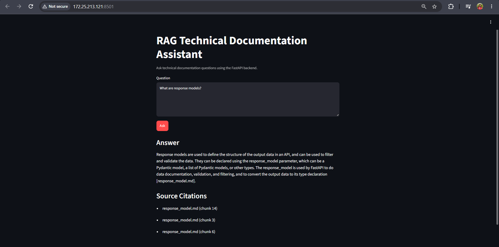
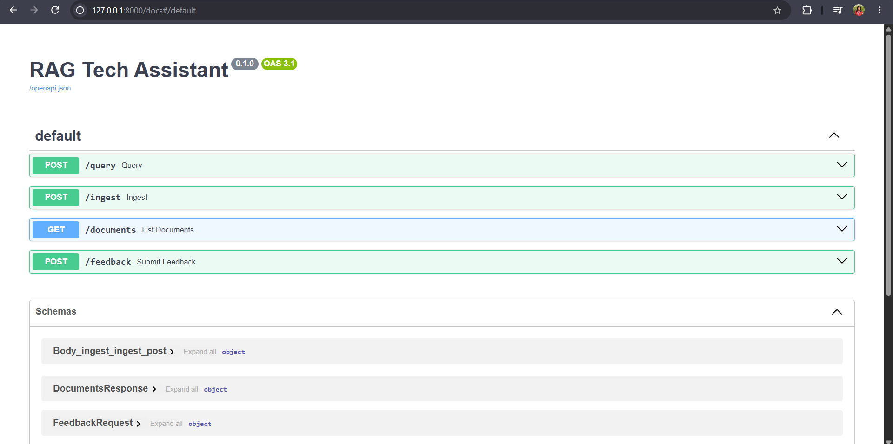

# RAG Tech Assistant

> A corrective Retrieval-Augmented Generation (RAG) assistant for technical documentation built with **LangGraph**, **FastAPI**, and **ChromaDB**.


## Overview

RAG Tech Assistant is a **self-corrective RAG system** that answers questions from technical documentation using a LangGraph workflow.

Instead of directly generating responses, the assistant:

- Rewrites ambiguous user queries
- Retrieves relevant documentation chunks from ChromaDB
- Grades retrieved documents for relevance
- Retries retrieval when context is insufficient
- Generates grounded answers with citations

The project is served through **FastAPI** and includes a **Streamlit frontend** for interactive querying.


## Features

- LangGraph-based corrective RAG workflow
- Query rewriting
- Semantic document retrieval using ChromaDB
- LLM-based document relevance grading
- Conditional routing with retry logic
- Grounded answer generation
- Source citations
- FastAPI REST API
- Streamlit frontend
- Markdown document ingestion
- Automated test suite (13 passing tests)


## System Architecture




## Application Screenshots

### Streamlit Frontend



---


### FastAPI Swagger UI




## Tech Stack

| Component | Technology |
|------------|------------|
| Language | Python |
| Backend | FastAPI |
| Workflow | LangGraph |
| LLM | Groq Llama 3.3 |
| Framework | LangChain |
| Vector Store | ChromaDB |
| Embeddings | sentence-transformers (MiniLM-L6-v2) |
| Frontend | Streamlit |
| Testing | Pytest |


## Getting Started

### 1. Clone the repository

```bash
git clone https://github.com/Vidhisahay/RAG-Tech-Assistant.git

cd RAG-Tech-Assistant
```


### 2. Create a virtual environment

```bash
python -m venv .venv
```

Activate it.

Windows

```bash
.venv\Scripts\activate
```

Linux / macOS

```bash
source .venv/bin/activate
```


### 3. Install dependencies

```bash
pip install -r requirements.txt
```

### 4. Configure environment variables

Create a `.env` file.

```env
GROQ_API_KEY=your_api_key
```


### 5. Build the vector database

```bash
python ingestion/ingest.py
```


### 6. Start FastAPI

```bash
uvicorn app.main:app --reload
```

Open

```
http://127.0.0.1:8000/docs
```


### 7. Start Streamlit

```bash
streamlit run ui/app.py
```

---


## API Endpoints

- `POST /query` - accept a question and return `answer` plus `sources`
- `POST /ingest` - ingest uploaded Markdown files and/or URLs
- `GET /documents` - return indexed document names
- `POST /feedback` - store thumbs-up/down feedback in `feedback.json`


### Example Query

Request

```json
{
    "question":"How do I define a request body in FastAPI?"
}
```

Response

```json
{
  "answer":"FastAPI uses Pydantic models...",
  "sources":[
      "request_body.md"
  ]
}
```


## Design Decisions

1. **RecursiveCharacterTextSplitter**- Chosen to preserve document structure while producing chunks that fit embedding model limits.
2. **MiniLM Embeddings**- Provides fast, lightweight embeddings with good semantic search performance for technical documentation.
3. **ChromaDB**- A lightweight persistent vector database that integrates well with LangChain and requires no external infrastructure.
4. **Document Grading**- LLM-based relevance grading filters noisy retrieval results before generation, improving answer quality.
5. **Retry Logic**- When no relevant documents are found, the graph rewrites the query and retries retrieval before returning a fallback response.


## Testing

The project includes automated tests covering:

- Document loading
- Chunking
- Retrieval
- Document grading
- Answer generation
- FastAPI endpoints

Run the test suite:

```bash
pytest
```

Current Status

```
13 passed
```

---

# Future Improvements

- Hallucination detection node
- Web search fallback
- Conversation memory
- Hybrid keyword + vector retrieval
- Reranking models
- Docker deployment

# Author

Made with ❤️ by Vidhi - [GitHub](https://github.com/Vidhisahay) · [LinkedIn](https://www.linkedin.com/in/vidhisahay/)