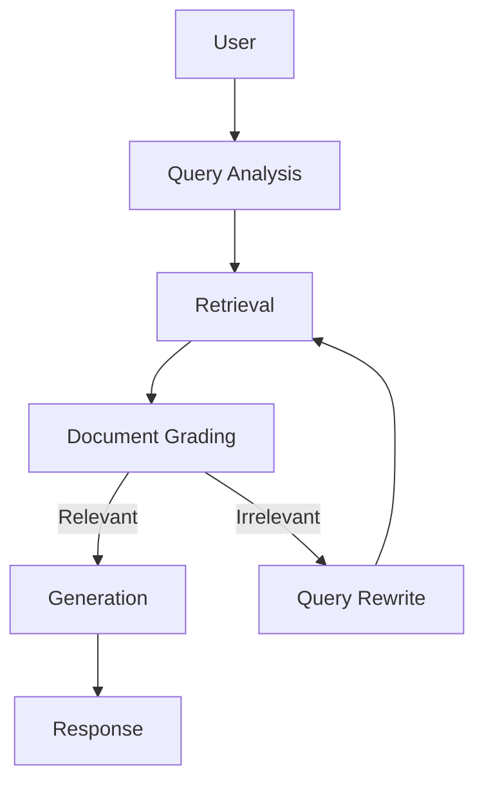

# RAG Tech Assistant

## Project Overview

RAG Tech Assistant is a corrective Retrieval-Augmented Generation (RAG) assistant for technical documentation built with LangGraph. It answers questions by rewriting the query when needed, retrieving relevant context from a local ChromaDB index, grading retrieved chunks, and generating grounded responses with cited sources.

## Architecture



## Tech Stack

- Python
- FastAPI
- LangGraph
- LangChain
- ChromaDB
- Sentence Transformers
- Groq Llama 3.3

## Folder Structure

```text
app/         FastAPI app, schemas, graph, and workflow nodes
docs/        Markdown documentation indexed into the knowledge base
ingestion/   Loaders, chunking, embeddings, and Chroma persistence
chroma_db/   Local vector store data
tests/       Project tests
```

## Setup Instructions

1. Create and activate a virtual environment.
2. Install dependencies:

```bash
pip install -r requirements.txt
```

3. Add your environment variables.

## Environment Variables

- `GROQ_API_KEY` - required for LangGraph query analysis, grading, and generation

Optional defaults are configured in `app/config.py` for the local Chroma directory and model settings.

## Running the Project

Run the API server:

```bash
uvicorn app.main:app --reload
```

Build or refresh the index from local Markdown files:

```bash
python ingestion/ingest.py
```

## API Endpoints

- `POST /query` - accept a question and return `answer` plus `sources`
- `POST /ingest` - ingest uploaded Markdown files and/or URLs
- `GET /documents` - return indexed document names
- `POST /feedback` - store thumbs-up/down feedback in `feedback.json`

## Design Decisions

- `RecursiveCharacterTextSplitter` preserves local structure while producing chunks that stay within embedding and retrieval limits.
- MiniLM embeddings provide a fast, lightweight local embedding model suitable for technical documentation search.
- ChromaDB is a simple persistent local vector store that fits the project’s offline-first workflow.
- Document grading reduces noisy retrieval results by filtering chunks before generation.
- Retry logic lets the graph rewrite the query and try retrieval again when the first pass is not relevant enough.

## Future Improvements

- Hallucination checker
- Conversation memory
- Web search fallback